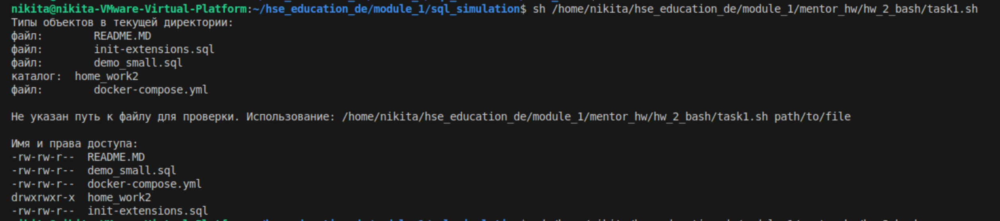
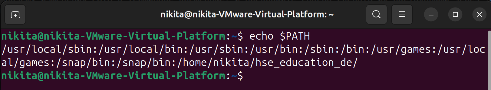
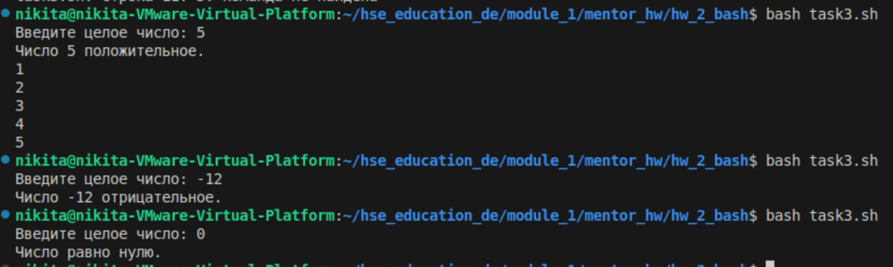
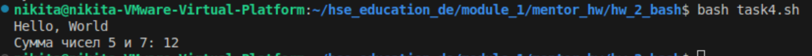
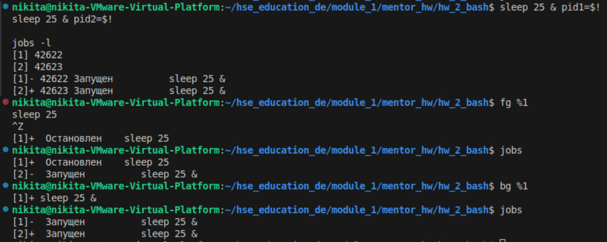
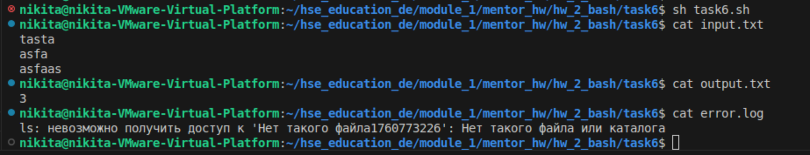
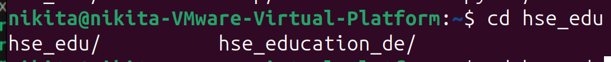
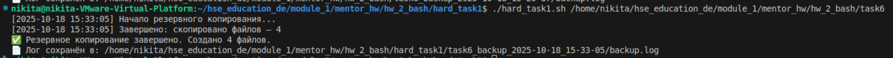
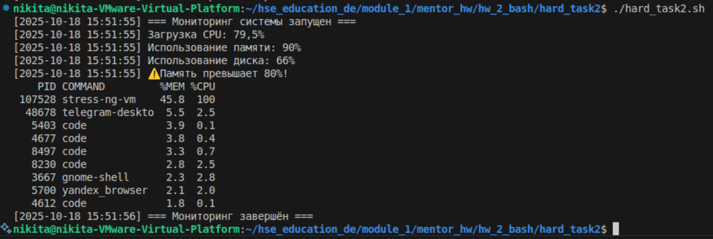
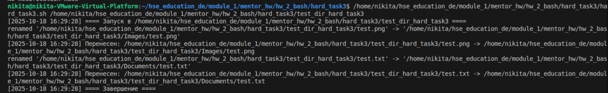

# Домашнее задание

| Параметр | Значение  |
| :-- | :-- |
| Дисциплина | Семинар наставника  |
| Тема | Тема 4. Работа с оболочкой Bash для решения задач в области инженерии данных  |
| Форма проверки | Задание с индивидуальной проверкой преподавателем. После дедлайна преподаватель проверит задания в течение полутора недель. Совет: выполняйте домашнее задание сразу после изучения темы  |
| Имя преподавателя | Владислав Шевченко  |
| Время выполнения | 2 часа  |
| Цель задания | Закрепить навык работы с Bash  |
| Инструменты для выполнения ДЗ | Ссылка на репозиторий на GitHub (public). Дополнительно можно приложить скриншоты  |
| Правила приёма работы | Отправьте ссылку на репозиторий в LMS или прикрепите файл со скриншотами выполнения задания  |
| Критерии оценки | За успешное выполнение 7 задач — 8 баллов. За меньшее количество задач баллы уменьшаются пропорционально  |
| Дедлайн | 1 ноября 2025  |

## Задачи

### 1. Функционал Bash

- Напишите Bash-скрипт, который:
    - Создаёт список всех файлов в текущей директории с указанием их типа (файл, каталог и т.д.)
    - Проверяет наличие файла, переданного как аргумент, и выводит сообщение о наличии/отсутствии
    - Использует цикл for для вывода: имя файла и права доступа

#### Решение
Скрипт task1.sh

#### Результат выполнения

### 2. Переменная PATH

- Напишите скрипт, который выводит текущее значение PATH и добавляет в него директорию из аргумента
- Объясните, почему изменения PATH в терминале временные, и предложите способ сделать их постоянными через .bashrc; покажите, как перезапустить оболочку для применения

#### Решение
Скрипт task2.sh

Это изменение действует только в текущем сеансе терминала.
После закрытия терминала переменная PATH возвращается к значению, заданному при запуске оболочки (bash заново читает свои конфигурационные файлы).
Чтобы они действовали постоянно можно изменить .bashrc добавив в коне export PATH="$PATH:/мой путь"
Тогда при каждом запуске терминала будет меняться PATH

#### Результат выполнения

### 3. Управляющие конструкции

- Скрипт запрашивает число и:
    - С помощью if определяет: положительное, отрицательное или ноль, и печатает сообщение
    - С помощью while считает от 1 до введённого числа (если оно положительное)

#### Решение
Скрипт task3.sh

#### Результат выполнения

### 4. Работа с функциями

- Создайте функцию, принимающую строку, и выводящую её с префиксом "Hello, "
- Создайте функцию, принимающую два числа и возвращающую их сумму; вызовите обе и продемонстрируйте результат

#### Решение
Скрипт task4.sh

#### Результат выполнения

### 5. Процессы и фон

- Запустите три команды sleep с разными временами в фоне
- Используйте jobs, fg, bg для демонстрации управления и опишите наблюдения

#### Решение
В скрипте task5.sh написаны команды, но для наглядности лучше запускать в интерактивном режиме.
Результатом стало, переключение работы джобы в начале в фон, потом из фона 

#### Результат выполнения

### 6. Ввод/вывод и перенаправление

- Скрипт должен:
    - Читать данные из файла input.txt
    - Перенаправлять вывод wc -l в output.txt
    - Перенаправлять ошибки ls несуществующего файла в error.log

#### Решение

В скрипте task6.sh

#### Результат выполнения

### 7. Alias и автодополнение

- Создайте alias ll для ls -la
- Напишите команду для постоянного сохранения alias и объясните, куда её добавить; продемонстрируйте автодополнение на примере cd
  
#### Решение
чтобы сделать алиас постоянным
echo "alias ll='ls -la'" >> ~/.bashrc
source ~/.bashrc

#### Результат выполнения

## Дополнительные сложные задачи

### Менеджер резервного копирования

- Создаёт резервную копию всех файлов в указанной директории, добавляя к именам текущую дату
- Ведёт лог операций в отдельный файл и уведомляет об успешном завершении с указанием количества файлов

#### Решение

В скрипте hard_task1/hard_task1.sh

#### Результат выполнения

### Мониторинг системы

- Сбор данных о загрузке CPU, использовании памяти и диска
- Уведомление, если использование памяти > 80%, с выводом наиболее ресурсозатратных процессов

#### Решение

В скрипте hard_task2/hard_task2.sh

#### Результат выполнения

### Автосортировка файлов

- Перемещает .jpg, .png, .gif в Images; .txt, .pdf, .docx — в Documents
- Запускается через cron каждую ночь и ведёт лог всех перемещений

#### Решение

В скрипте hard_task3/hard_task3.sh
Для запуска крона каждую ночь в 2 15 добавил команду в crontab -e
15 2 * * * /home/nikita/hse_education_de/module_1/mentor_hw/hw_2_bash/hard_task3/hard_task3.sh /home/nikita/hse_education_de/module_1/mentor_hw/hw_2_bash/hard_task3/test_dir_hard_task3 
Логирование в файле hard_task3/test_dir_hard_task3/organize_downloads.log

#### Результат выполнения

