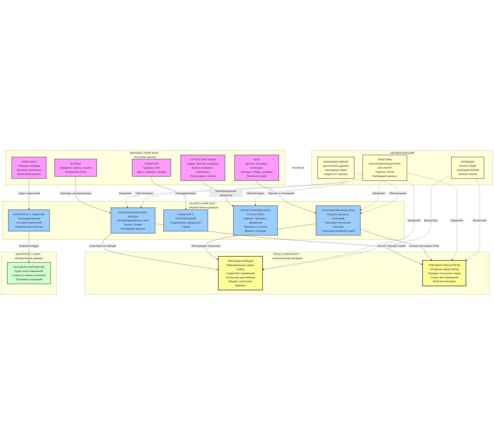
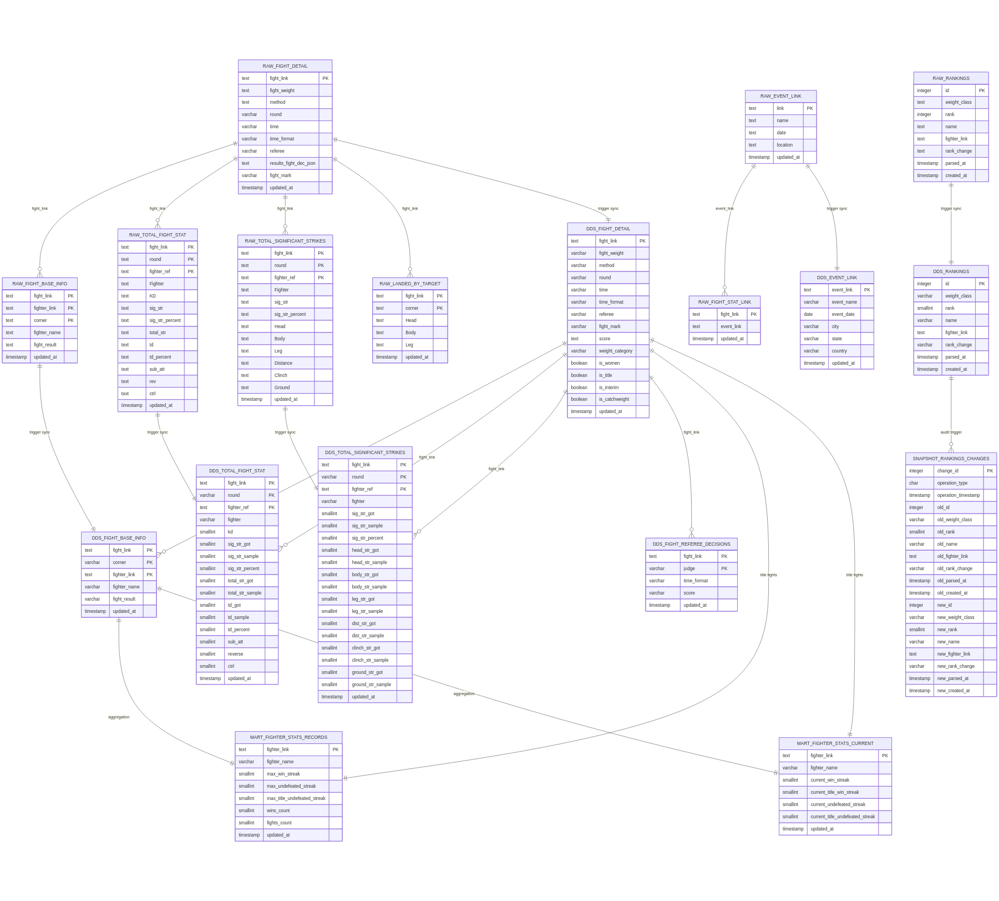

# 📚 Финальное задание студента Чумурова Н.О.

## Содержание

1. [Описание предметной области](#Описание-предметной-области)
2. [Обзор архитектуры](#обзор-архитектуры)
3. [Диаграммы архитектуры](#диаграммы-архитектуры)
4. [Слои данных (Medallion Architecture)](#слои-данных-medallion-architecture)
5. [Описание таблиц](#описание-таблиц)
6. [Функции и триггеры](#функции-и-триггеры)
7. [Синхронизация данных](#синхронизация-данных)
8. [Примеры запросов](#примеры-запросов)

---
## Описание предметной области

**UFC (Ultimate Fighting Championship)** - спортивная организация, которая базируется в США и проводит бои по смешанным единоборствам.
Современные спортивные организации по типу UFC, аккумулируют огромное количество статистических данных: количество ударов, тейкдаунов, точность попаданий, длительность боёв, решения судей, и многое другое.

Однако, несмотря на открытые источники (например, сайт ufcstats.com), эти данные представлены в неудобной для анализа форме.
В рамках учебного проекта предлагается разработать базу данных для хранения и анализа статистики боёв UFC, собранной с помощью Python-парсера.
Проект ориентирован на аналитиков и фанатов боев UFC, это даст возможность быстро и легко получать различные интересные факты и инсайды из огромного набора данных, накопленного за 30-летнее существование организации.


## Обзор архитектуры

### 🏗️ Тип архитектуры
**Medallion Architecture** (медальонная архитектура) - современная многослойная архитектура для аналитических систем и data warehouse, реализованная в PostgreSQL.

### 📊 Поток данных
```
Веб-скрапер (ufcstats.com)
        ↓
    [RAW слой]
   Сырые данные
        ↓
    [DDS слой]
  Нормализованные,
  денормализованные
    и парсенные
        ↓
   [MART слой]
Готовые метрики
  и витрины
        ↓
  Отчеты/BI
```

### 🎯 Цель
Извлечение данных UFC статистики из ufcstats.com, хранение в структурированном виде с автоматической синхронизацией между слоями.

---

## Диаграммы архитектуры

### 🏗️ Концептуальная диаграмма
Общая архитектура системы с потоками данных:



### 📊 ER-диаграмма базы данных
Схема связей между таблицами в слоях RAW, DDS и MART:



---

## Слои данных (Medallion Architecture)

### 🥉 Bronze слой (RAW схема)
**Назначение:** Хранение исходных, необработанных данных в исходном формате

**Характеристики:**
- Исходные данные из HTML парсинга
- JSON данные без преобразований
- Используется как источник истины для переобработки
- Хранит кэш HTML для повторной обработки

**Таблицы:**
- `raw.event_link` - события UFC
- `raw.fight_stat_link` - связь событий и боев
- `raw.fight_detail` - детали боев (сырые)
- `raw.fight_base_info` - информация о бойцах (сырые)
- `raw.total_fight_stat` - общая статистика боев
- `raw.total_significant_strikes` - значимые удары
- `raw.html_storage` - кэш HTML страниц (~75 MB)

---

### 🥈 Silver слой (DDS схема)
**Назначение:** Нормализованные, очищенные и оптимизированные данные

**Характеристики:**
- Данные парсены из JSON/текста в отдельные колонки
- Использованы оптимизированные типы данных (varchar вместо text)
- Нормализованы весовые категории и добавлены признаки
- Автоматическая синхронизация через триггеры
- Удалены дублирующиеся и временные данные

**Таблицы:**

#### 1. `dds.fight_detail` - Детали боев
```sql
Колонки:
- fight_link (text, PK) - уникальный URL боя
- time_format (varchar(20)) - формат раунда (3 Rnd, 5 Rnd)
- fight_weight (varchar(70)) - исходная весовая категория
- weight_category (varchar(50)) - нормализованная категория
- method (varchar(25)) - способ окончания боя
- round (varchar(5)) - раунд
- time (varchar(10)) - время в раунде
- referee (varchar(25)) - имя судьи
- fight_mark (varchar(22)) - маркировка боя
- score (text) - агрегированные решения судей (Judge: X-Y, ...)
- is_women (boolean) - женский вес
- is_title (boolean) - титульный бой
- is_interim (boolean) - временный титул
- is_catchweight (boolean) - промежуточный вес
- updated_at (timestamp) - дата последнего обновления

Примеры:
- weight_category: Lightweight, Women's Strawweight, Heavyweight
- method: KO/TKO, Submission, Decision - Unanimous
- score: Derek Cleary: 28 - 29, Junichiro Kamijo: 28 - 29
```

#### 2. `dds.fight_base_info` - Информация о бойцах
```sql
Колонки:
- fighter_link (text, PK часть) - уникальный URL бойца
- fight_link (text, PK часть) - уникальный URL боя
- corner (varchar(10)) - угол (red/blue)
- fighter_name (varchar(30)) - имя бойца
- fight_result (varchar(10)) - результат боя (W/L/D)
- updated_at (timestamp) - дата последнего обновления

Количество: 16,856 записей (8,428 уникальных боёв × 2 бойца)
```

#### 3. `dds.fight_referee_decisions` - Решения судей
```sql
Колонки:
- fight_link (text, PK часть) - уникальный URL боя
- judge (varchar(255), PK часть) - имя судьи
- time_format (varchar(20)) - формат раунда
- score (varchar(7)) - решение судьи (28-29, 29-28, etc)
- updated_at (timestamp) - дата последнего обновления

Количество: 11,582 записей
```

#### 4. `dds.total_fight_stat` - Полная статистика боев
```sql
Колонки:
- fight_link (text, PK часть)
- fighter_ref (text, PK часть)
- fighter (varchar(30))
- sig_str_got (smallint) - значимые удары - получено
- sig_str_sample (smallint) - значимые удары - попыток
- sig_str_percent (smallint) - процент значимых ударов
- total_str_got (smallint) - все удары - получено
- total_str_sample (smallint) - все удары - попыток
- td_got (smallint) - броски - успешные
- td_sample (smallint) - броски - попыток
- td_percent (smallint) - процент бросков
- sub_att (smallint) - попытки сабмишнов
- reverse (smallint) - количество reverse
- ctrl (smallint) - время контроля в секундах
- round (varchar(5))
- updated_at (timestamp)

Количество: 56,438 записей
```

#### 5. `dds.total_significant_strikes` - Значимые удары по зонам
```sql
Колонки:
- fight_link (text, PK часть)
- round (varchar(5), PK часть)
- fighter_ref (text, PK часть)
- fighter (varchar(30))
- sig_str_got (smallint) - общие значимые удары - получено
- sig_str_sample (smallint) - общие значимые удары - попыток
- sig_str_percent (smallint)
- head_str_got, head_str_sample (smallint) - удары в голову
- body_str_got, body_str_sample (smallint) - удары в корпус
- leg_str_got, leg_str_sample (smallint) - удары в ноги
- dist_str_got, dist_str_sample (smallint) - удары на дистанции
- clinch_str_got, clinch_str_sample (smallint) - удары в клинче
- ground_str_got, ground_str_sample (smallint) - удары на земле
- updated_at (timestamp)

Количество: 56,438 записей
```

#### 6. `dds.event_link` - События UFC
```sql
Колонки:
- event_link (text, PK) - уникальный URL события
- event_name (varchar(128)) - название события
- event_date (date) - дата события
- city (varchar(64)) - город
- state (varchar(64)) - штат (для США/Канады)
- country (varchar(64)) - страна
- updated_at (timestamp)

Примеры:
- event_name: UFC 321: Aspinall vs. Gane
- city: Abu Dhabi, state: Abu Dhabi, country: United Arab Emirates

Количество: 752 события
```

---

### 🥇 Gold слой (MART схема)
**Назначение:** Готовые к анализу витрины данных и агрегированные метрики

**Характеристики:**
- Высокоуровневые метрики и статистика
- Оптимизировано для BI-инструментов
- Кэшированные вычисления
- Легко использовать для отчетов

**Таблицы:**

#### 1. `mart.fighter_stats_records` - Рекордные показатели бойцов
```sql
Колонки:
- fighter_link (text, PK) - уникальный URL бойца
- fighter_name (varchar(30)) - имя бойца
- max_win_streak (smallint) - максимальная серия побед за карьеру
- max_undefeated_streak (smallint) - максимальная серия без поражений
- max_title_undefeated_streak (smallint) - максимальная серия титульных без поражений
- wins_count (smallint) - общее количество побед
- fights_count (smallint) - общее количество боев
- updated_at (timestamp)

Примеры топ бойцов:
- Jim Miller: 27 побед подряд, 44 боя всего
- Jon Jones: 22 побед подряд, 16 титульных без поражений
- Anderson Silva: 16 титульных без поражений

Количество: 2,628 бойцов
```

#### 2. `mart.fighter_stats_current` - Текущие серии бойцов
```sql
Колонки:
- fighter_link (text, PK) - уникальный URL бойца
- fighter_name (varchar(30)) - имя бойца
- current_win_streak (smallint) - текущая серия побед
- current_undefeated_streak (smallint) - текущая серия без поражений
- current_title_win_streak (smallint) - текущая серия титульных побед
- current_title_undefeated_streak (smallint) - текущая серия титульных без поражений
- updated_at (timestamp)

Примеры активных серий:
- Islam Makhachev: 15 побед подряд, 5 титульных побед подряд
- Merab Dvalishvili: 14 побед подряд

Количество: 2,628 бойцов
```

---

## Описание таблиц

### Нормализация весовых категорий (dds.fight_detail)

Процесс нормализации преобразует разнообразные форматы в стандартные категории:

```
Исходный формат                    → Нормализованный вес
─────────────────────────────────────────────────────
Lightweight Bout                   → Lightweight
Women's Strawweight Bout           → Women's Strawweight
UFC Lightweight Title Bout         → Lightweight (с is_title=true)
UFC Interim Heavyweight Title Bout → Heavyweight (с is_interim=true)
13 Heavyweight Tournament          → Heavyweight
10 Tournament                      → Open Weight
Road to UFC 1 Flyweight Title     → Flyweight (с is_title=true)
Catch Weight Bout                  → Catch Weight
```

**Признаки (flags):**
- `is_women` - женская весовая категория
- `is_title` - титульный бой
- `is_interim` - временный титул
- `is_catchweight` - промежуточный вес

---

## Функции и триггеры

### Система триггеров

Архитектура использует автоматические триггеры для синхронизации данных между слоями.

#### 1. **dds.process_fight_detail()**
**Триггер:** `trg_fight_detail_sync`  
**События:** INSERT/UPDATE на `raw.fight_detail`

**Логика:**
- Парсит JSON из `results_fight_dec_json`
- Нормализует весовую категорию
- Добавляет признаки (is_women, is_title, is_interim, is_catchweight)
- Агрегирует решения судей в одно поле `score`
- Вставляет/обновляет в `dds.fight_detail`

**Пример результата:**
```
results_fight_dec_json: 
[{"judge": "Derek Cleary", "score": "28 - 29"}, 
 {"judge": "Junichiro Kamijo", "score": "28 - 29"}]

→ score: "Derek Cleary: 28 - 29, Junichiro Kamijo: 28 - 29"
```

---

#### 2. **dds.process_fight_base_info()**
**Триггер:** `trg_fight_base_info_sync`  
**События:** INSERT/UPDATE на `raw.fight_base_info`

**Логика:**
- Синхронизирует информацию о бойцах
- Проходит через `dds.fight_base_info`
- Триггер на `dds.fight_base_info` инициирует пересчет в mart

---

#### 3. **dds.process_total_fight_stat()**
**Триггер:** `trg_total_fight_stat_sync`  
**События:** INSERT/UPDATE на `raw.total_fight_stat`

**Логика:**
- Парсит строки "X of Y" в отдельные колонки
- Преобразует проценты ("X%", "---" → smallint)
- Преобразует время контроля "MM:SS" в секунды
- Вставляет в `dds.total_fight_stat`

**Примеры преобразований:**
```
"Sig. str" "10 of 15"  → sig_str_got: 10, sig_str_sample: 15
"Sig. str. %" "67%"    → sig_str_percent: 67
"Sig. str. %" "---"    → sig_str_percent: 0
"Ctrl" "5:23"          → ctrl: 323 (секунды)
"Ctrl" "---"           → ctrl: 0
```

---

#### 4. **dds.process_total_significant_strikes()**
**Триггер:** `trg_total_significant_strikes_sync`  
**События:** INSERT/UPDATE на `raw.total_significant_strikes`

**Логика:**
- Аналогична total_fight_stat
- Парсит удары по зонам (Head, Body, Leg, Distance, Clinch, Ground)
- Преобразует "X of Y" формат

---

#### 5. **dds.process_fight_referee_decisions()**
**Триггер:** `trg_fight_referee_decisions_sync`  
**События:** INSERT/UPDATE на `raw.fight_detail`

**Логика:**
- Парсит JSON `results_fight_dec_json`
- Извлекает judge и score для каждого элемента
- Вставляет в `dds.fight_referee_decisions`
- Используется `ON CONFLICT DO NOTHING` (данные не меняются)

---

#### 6. **mart.process_fighter_stats_records()**
**Триггер:** `trg_fighter_records_sync_base`, `trg_fighter_records_sync_detail`  
**События:** INSERT/UPDATE/DELETE на `dds.fight_base_info`, INSERT/UPDATE на `dds.fight_detail`

**Логика рассчета максимальных серий:**
1. Получает все бои бойца, отсортированные по дате
2. Рассчитывает максимальную серию побед (W подряд)
3. Рассчитывает максимальную серию без поражений (W или D подряд)
4. Рассчитывает максимальную серию титульных боев без поражений
5. Сумирует общие победы и титульные победы

**Оконные функции:**
```sql
-- Определение групп побед
CASE WHEN is_win = 1 AND LAG(is_win) OVER (ORDER BY fight_date) = 1
     THEN 0 ELSE 1 END AS new_group

-- Расчет длины серии
COUNT(*) AS streak_len
GROUP BY fighter_name, group_id
```

---

#### 7. **mart.process_fighter_stats_current()**
**Триггер:** `trg_fighter_current_sync_base`, `trg_fighter_current_sync_detail`  
**События:** INSERT/UPDATE/DELETE на `dds.fight_base_info`, INSERT/UPDATE на `dds.fight_detail`

**Логика рассчета текущих серий:**
1. Получает последние бои бойца (ORDER BY event_date DESC)
2. Использует ROW_NUMBER() для нумерации с конца
3. Считает текущие подряд идущие W/L/D с конца
4. Останавливается на первом поражении

**Ключевой момент:**
```sql
ROW_NUMBER() OVER (PARTITION BY fighter_link ORDER BY event_date DESC) as rn
-- rn = 1 это последний бой
-- Проверяем W/L/D подряд с конца
```

---

## Синхронизация данных

### 🔄 Поток синхронизации

```
┌─────────────────────────────────────────────────────────┐
│ 1. INSERT/UPDATE в raw слой                             │
│    (напр., raw.fight_detail)                            │
└──────────────────┬──────────────────────────────────────┘
                   │
                   ↓ Триггер срабатывает
┌─────────────────────────────────────────────────────────┐
│ 2. Функция триггера парсит и трансформирует данные    │
│    (напр., dds.process_fight_detail())                 │
└──────────────────┬──────────────────────────────────────┘
                   │
                   ↓ ON CONFLICT DO UPDATE
┌─────────────────────────────────────────────────────────┐
│ 3. INSERT/UPDATE в dds слой (silver)                   │
│    (напр., dds.fight_detail)                           │
└──────────────────┬──────────────────────────────────────┘
                   │
                   ↓ Триггер на dds слое
┌─────────────────────────────────────────────────────────┐
│ 4. Каскадное срабатывание триггеров для mart           │
│    (напр., mart.process_fighter_stats_records())       │
└──────────────────┬──────────────────────────────────────┘
                   │
                   ↓ Пересчет метрик
┌─────────────────────────────────────────────────────────┐
│ 5. UPDATE в mart слой (gold)                           │
│    (напр., mart.fighter_stats_records)                 │
└─────────────────────────────────────────────────────────┘
```

### ⚙️ Режим обновления (Refresh Mode)

При каждом запуске парсера:
1. **Событиям (events)** - используется UPSERT (обновить или вставить)
2. **Боям (fights)** - DELETE WHERE fight_link = ? затем INSERT (полная переобработка)
3. **Статистике (stats)** - DELETE + INSERT для каждого боя

**Преимущества:**
- Всегда актуальные данные
- Обновляются ~50 последних событий и их полная статистика
- Автоматически синхронизируется через триггеры

---

## Примеры запросов

### 📊 Аналитические запросы

Представлены 5 аналитических запросов, каждый из которых демонстрирует использование требуемых SQL конструкций.

#### Запрос 1: Процент досрочных побед и решений по годам
**Файл:** `sql/query_1_fighter_performance_ranking.sql`

**Использованные конструкции:**
- ✅ Общие табличные выражения (1 CTE)
- ✅ Оконные функции (ROW_NUMBER() OVER PARTITION BY)
- ✅ Соединения таблиц (4 JOIN)
- ✅ Агрегатные функции с HAVING

**Описание:** Анализирует процент досрочных побед (KO/TKO/Submission) и побед по решению судей для бойцов по годам. Рассчитывает ранжирование бойцов по количеству досрочных побед в каждом году, показывает тренды изменения стиля боя от года к году.

**Вывод**
| rank | fight_year | fighter_name | total_fights | total_wins | early_wins | decision_wins | early_win_rate_percent | decision_win_rate_percent | overall_win_rate_percent |
|------|------------|--------------|--------------|------------|------------|---------------|------------------------|---------------------------|--------------------------|
| 1 | 2025 | Valter Walker | 3 | 3 | 3 | 0 | 100.0 | 0.0 | 100.0 |
| 2 | 2025 | Ateba Gautier | 3 | 3 | 3 | 0 | 100.0 | 0.0 | 100.0 |
| 3 | 2025 | Reinier de Ridder | 4 | 3 | 2 | 1 | 66.7 | 33.3 | 75.0 |
| 4 | 2025 | Jean Silva | 3 | 2 | 2 | 0 | 100.0 | 0.0 | 66.7 |
| 5 | 2025 | Jimmy Crute | 3 | 2 | 2 | 0 | 100.0 | 0.0 | 66.7 |
---

#### Запрос 2: Анализ карьерного прогресса бойцов
**Файл:** `sql/query_2_fighter_career_progression.sql`

**Использованные конструкции:**
- ✅ Общие табличные выражения (2 CTE)
- ✅ Оконные функции (ROW_NUMBER(), LAG(), LEAD())
- ✅ Соединения таблиц (4 JOIN)

**Описание:** Анализирует прогресс бойцов по карьере, разделяя её на периоды (начало, середина, недавнее время) и сравнивая процент побед в каждом периоде. Выявляет тренды развития (улучшение, снижение или стабильность) только для бойцов с титульными боями.

**Вывод**

| fighter_name | total_fights | title_fights | title_wins | early_career_win_rate | mid_career_win_rate | recent_career_win_rate | career_trend |
|--------------|--------------|--------------|------------|-----------------------|---------------------|------------------------|--------------|
| Jon Jones | 24 | 17 | 16 | 80.0 | 100.0 | 88.9 | Улучшение |
| Georges St-Pierre | 22 | 15 | 13 | 80.0 | 90.0 | 100.0 | Улучшение |
| Demetrious Johnson | 18 | 14 | 12 | 60.0 | 100.0 | 66.7 | Снижение |
| Anderson Silva | 25 | 13 | 11 | 100.0 | 100.0 | 20.0 | Снижение |
| Amanda Nunes | 18 | 12 | 11 | 80.0 | 100.0 | 66.7 | Снижение |

---

#### Запрос 3: Сравнение эффективности боевых техник по весовым категориям
**Файл:** `sql/query_3_technique_comparison_by_weight.sql`

**Использованные конструкции:**
- ✅ Подзапросы (в SELECT и WHERE)
- ✅ Общие табличные выражения (2 CTE)
- ✅ Оконные функции (RANK() - множественные)
- ✅ Соединения таблиц (3 JOIN)

**Описание:** Ранжирует весовые категории по различным боевым техникам (значимые удары, броски, сабмишны, контроль). Определяет доминирующую технику в каждой категории, позволяя выявить характерный стиль борьбы.

**Вывод**

| weight_category | total_fights | avg_sig_strikes | sig_strike_rank | avg_total_strikes | total_strike_rank | avg_takedowns | takedown_rank | avg_submission_attempts | submission_rank | avg_control_time | control_rank | dominant_technique |
|-----------------|--------------|-----------------|-----------------|-------------------|-------------------|---------------|---------------|-------------------------|-----------------|------------------|--------------|--------------------|
| Heavyweight | 1489 | 19.49 | 12 | 29.56 | 12 | 0.52 | 12 | 0.17 | 12 | 72.63 | 12 | Контроль |
| Lightweight | 1413 | 21.48 | 9 | 31.55 | 10 | 0.68 | 4 | 0.26 | 3 | 80.04 | 8 | Контроль |
| Welterweight | 1366 | 21.01 | 10 | 32.47 | 8 | 0.65 | 6 | 0.24 | 4 | 84.24 | 5 | Контроль |
| Middleweight | 1109 | 19.79 | 11 | 29.99 | 11 | 0.61 | 8 | 0.24 | 4 | 77.89 | 9 | Контроль |
| Featherweight | 826 | 24.25 | 6 | 34.27 | 6 | 0.67 | 5 | 0.24 | 4 | 76.74 | 10 | Контроль |

---

#### Запрос 4: Анализ тенденций в судейских решениях
**Файл:** `sql/query_4_judge_decisions_analysis.sql`

**Использованные конструкции:**
- ✅ Подзапросы (в SELECT для определения несогласных судей)
- ✅ Общие табличные выражения (3 CTE)
- ✅ Оконные функции (COUNT() OVER, ROW_NUMBER())
- ✅ Соединения таблиц (5 JOIN)

**Описание:** Анализирует судейские решения на последних событиях (90 дней). Подсчитывает голоса судей, определяет единогласные решения и выявляет судей, которые голосовали против большинства (несогласные судьи).

**Вывод**


| event_link | fight_link | red_fighter | blue_fighter | red_votes | blue_votes | tie_votes |
|------------|------------|-------------|--------------|-----------|------------|-----------|
| http://ufcstats.com/event-details/0e2c2daf11b5d8f2 | http://ufcstats.com/fight-details/32927d50acedb507 | Alice Ardelean | Montserrat Conejo Ruiz | 0 | 3 | 0 |
| http://ufcstats.com/event-details/0e2c2daf11b5d8f2 | http://ufcstats.com/fight-details/58f6248da3cdf3ce | Timmy Cuamba | ChangHo Lee | 0 | 3 | 0 |
| http://ufcstats.com/event-details/0e2c2daf11b5d8f2 | http://ufcstats.com/fight-details/71c8ca7442bcb757 | Charles Radtke | Daniel Frunza | 0 | 0 | 1 |
| http://ufcstats.com/event-details/0e2c2daf11b5d8f2 | http://ufcstats.com/fight-details/747d922b329b7f30 | Steve Garcia | David Onama | 0 | 0 | 1 |
| http://ufcstats.com/event-details/0e2c2daf11b5d8f2 | http://ufcstats.com/fight-details/760150e9951e65fa | Ketlen Vieira | Norma Dumont | 1 | 2 | 0 |

---

#### Запрос 5: Комплексный анализ эволюции боевого стиля
**Файл:** `sql/query_5_fighting_style_evolution.sql`

**Использованные конструкции:**
- ✅ Подзапросы (в WHERE и SELECT для получения данных пика карьеры)
- ✅ Общие табличные выражения (3 CTE)
- ✅ Оконные функции (ROW_NUMBER(), AVG() OVER, LAG(), LEAD())
- ✅ Соединения таблиц (5 JOIN)

**Описание:** Отслеживает эволюцию боевого стиля бойца на протяжении карьеры. Сравнивает раннюю карьеру с пиком, рассчитывая изменения в количестве ударов, процент точности и использовании техник борьбы. Классифицирует эволюцию стиля (улучшение, переход к защите, развитие борьбы и т.д.).

**Вывод**


| fighter_name | early_sig_strikes | current_sig_strikes | sig_strike_change_percent | early_takedowns | current_takedowns | takedown_change_percent | early_accuracy | current_accuracy | accuracy_change | style_evolution |
|--------------|-------------------|---------------------|---------------------------|-----------------|-------------------|--------------------------|----------------|------------------|-----------------|------------------|
| Tom DeBlass | 0.67 | 22.00 | 3183.6 | 1.33 | 0.00 | -100.0 | 16.3 | 36.5 | 20.2 | Значительное улучшение в ударной технике |
| Rafael Fiziev | 1.00 | 32.83 | 3183.0 | 0.00 | 0.39 |  | 100.0 | 51.6 | -48.4 | Стабильный стиль |
| Artem Lobov | 1.00 | 32.77 | 3177.0 | 0.00 | 0.29 |  | 10.0 | 42.1 | 32.1 | Значительное улучшение в ударной технике |
| Thiago Silva | 1.00 | 26.01 | 2501.0 | 1.00 | 0.34 | -66.0 | 100.0 | 46.9 | -53.1 | Стабильный стиль |
| Nate Diaz | 1.33 | 33.66 | 2430.8 | 0.00 | 0.30 |  | 33.3 | 40.7 | 7.4 | Значительное улучшение в ударной технике |

---

## 🔐 Индексы

Созданные индексы для оптимизации производительности:

```sql
-- Primary Keys (создают индексы автоматически)
dds.fight_detail.fight_link
dds.fight_base_info.(fight_link, fighter_link)
dds.fight_referee_decisions.(fight_link, judge)
dds.event_link.event_link
mart.fighter_stats_records.fighter_link
mart.fighter_stats_current.fighter_link

-- Дополнительные индексы
dds.fight_referee_decisions.fight_link
dds.event_link.event_link
```

---

## 📈 Размер данных

| Слой | Таблица | Записей | Размер |
|------|---------|---------|--------|
| raw | fight_detail | 8,428 | ~20 MB |
| raw | fight_base_info | 16,856 | ~15 MB |
| raw | total_fight_stat | 56,438 | ~30 MB |
| raw | total_significant_strikes | 56,438 | ~25 MB |
| raw | event_link | 752 | ~100 KB |
| raw | fight_stat_link | ~8,000 | ~200 KB |
| raw | html_storage | ~8,000 | ~75 MB (кэш HTML) |
| dds | * | * | ~150 MB |
| mart | * | * | ~5 MB |
| **ИТОГО** | | | **~397 MB** (дамп) |


## 📋 Таблица соответствия слоев

| Концепция | RAW (Bronze) | DDS (Silver) | MART (Gold) |
|-----------|--------------|--------------|------------|
| **Назначение** | Сырые данные | Нормализованные | Метрики |
| **Обновления** | ~50 последних | Триггеры | Триггеры |
| **Преобразования** | Нет | Парсинг JSON, нормализация | Агрегация, расчеты |
| **Типы данных** | text, JSON | varchar, smallint | smallint |
| **Готовность** | Низкая | Средняя | Высокая |
| **Для BI** | Нет | Подходит | ✅ Да |

---

## 🔧 Техническая информация

- **СУБД:** PostgreSQL 18.0
- **Схемы:** raw, dds, mart
- **Язык:** SQL, PL/pgSQL
- **Основной источник:** ufcstats.com
---
