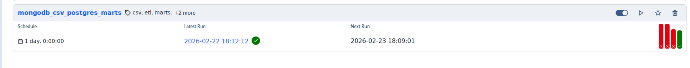
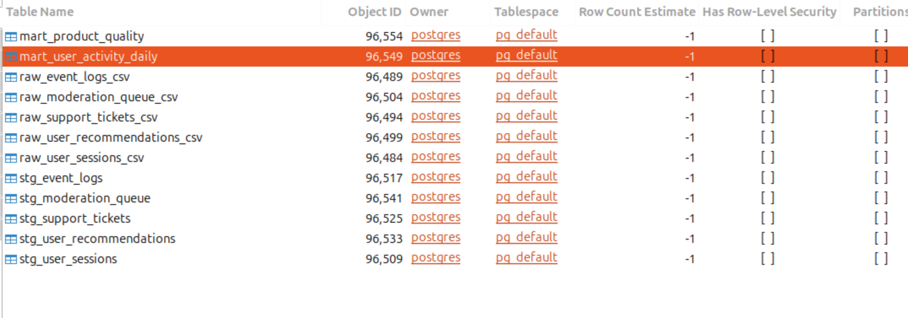
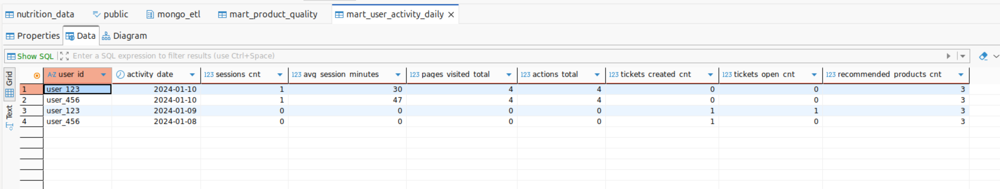
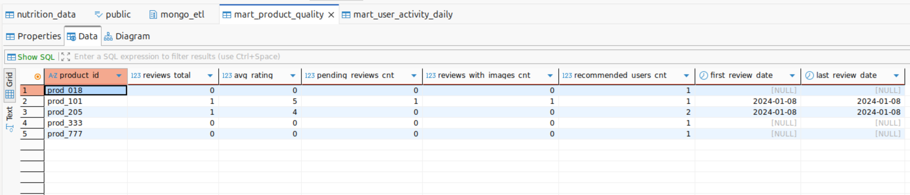

# Отчет о выполнении дз 1 по ETL

Даг написан лежит по пути dags/data_ingestion_dag.py
Можно увидеть успешное выполенение по пути

Результат

# Отчет о выполнении дз 2 по ETL

Даг написан лежит по пути dags/iot_temp_dag.py
Можно увидеть успешное выполенение по пути

вычислите 5 самых жарких и самых холодных дней за год;

отфильтруйте out/in = in;

поле noted_date переведите в формат ‘yyyy-MM-dd’ с типом данных date;

очистите температуру по 5-му и 95-му процентилю.

# Отчет о выполнении дз 3 по ETL

Я добавил новую таску в даг dags/iot_temp_dag.py

reate_analytical_tables_last_10_days()

вот результат созданные таблицы
raw>stg>mart слой

# Итоговое задание модуль 3

Даг 
dags/mongodb_csv_postgres_marts_dag.py
Отработал 

Все таблицы в postgresql

Итоговые аналитические таблицы

1. `mongo_etl.mart_user_activity_daily` (активность пользователей по дням)
- `user_id` — идентификатор пользователя
- `activity_date` — дата активности
- `sessions_cnt` — количество сессий пользователя за день
- `avg_session_minutes` — средняя длительность сессии (в минутах)
- `pages_visited_total` — суммарное количество посещённых страниц
- `actions_total` — суммарное количество действий пользователя
- `tickets_created_cnt` — количество созданных обращений в поддержку
- `tickets_open_cnt` — количество обращений со статусом `open`
- `recommended_products_cnt` — количество рекомендованных пользователю товаров

Источники: `stg_user_sessions`, `stg_support_tickets`, `stg_user_recommendations`.

2. `mongo_etl.mart_product_quality` (метрики качества и модерации по товарам)
- `product_id` — идентификатор товара
- `reviews_total` — общее количество отзывов
- `avg_rating` — средний рейтинг
- `pending_reviews_cnt` — количество отзывов со статусом модерации `pending`
- `reviews_with_images_cnt` — количество отзывов с флагом `contains_images`
- `recommended_users_cnt` — количество пользователей, которым рекомендован товар
- `first_review_date` — дата первого отзыва
- `last_review_date` — дата последнего отзыва

Источники: `stg_moderation_queue`, `stg_user_recommendations`.

