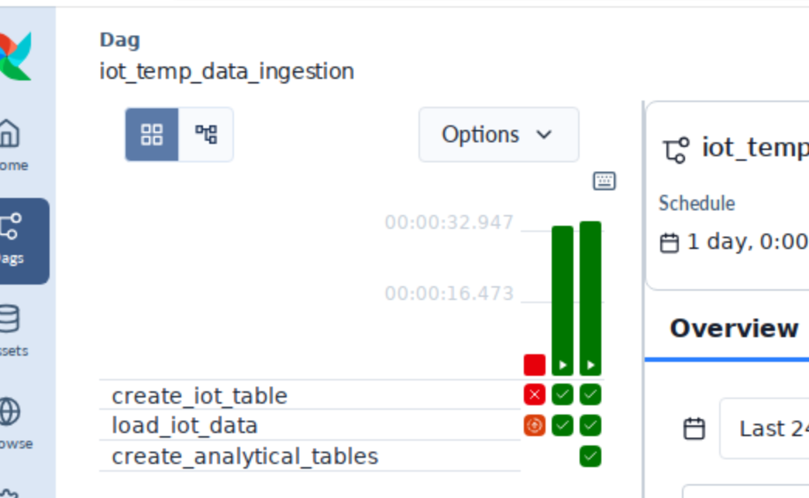
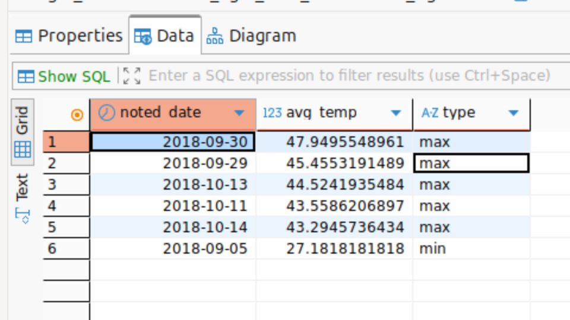
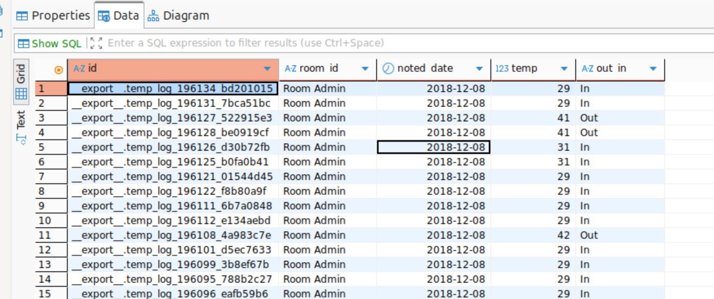
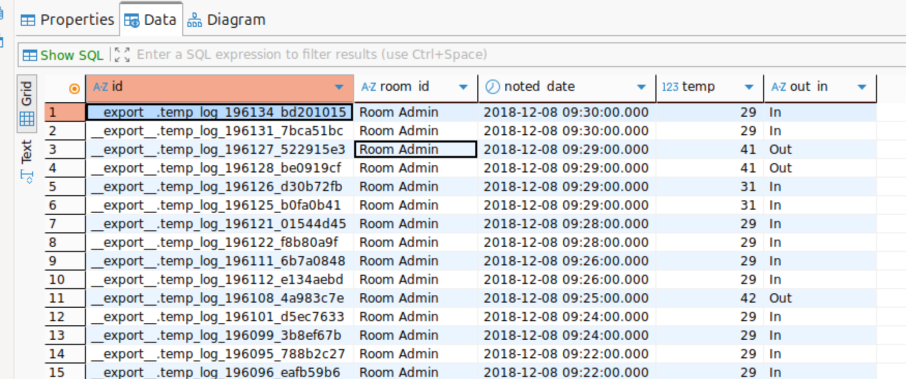
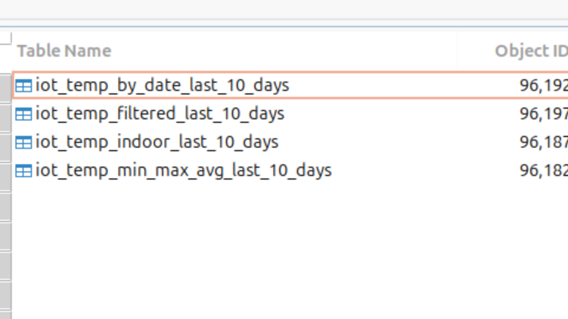

# Отчет о выполнении дз 1 по ETL

Даг написан лежит по пути dags/data_ingestion_dag.py
Можно увидеть успешное выполенение по пути

Результат

# Отчет о выполнении дз 2 по ETL

Даг написан лежит по пути dags/iot_temp_dag.py
Можно увидеть успешное выполенение по пути

вычислите 5 самых жарких и самых холодных дней за год;

отфильтруйте out/in = in;

поле noted_date переведите в формат ‘yyyy-MM-dd’ с типом данных date;

очистите температуру по 5-му и 95-му процентилю.

# Отчет о выполнении дз 3 по ETL

Я добавил новую таску в даг dags/iot_temp_dag.py

reate_analytical_tables_last_10_days()

вот результат созданные таблицы

